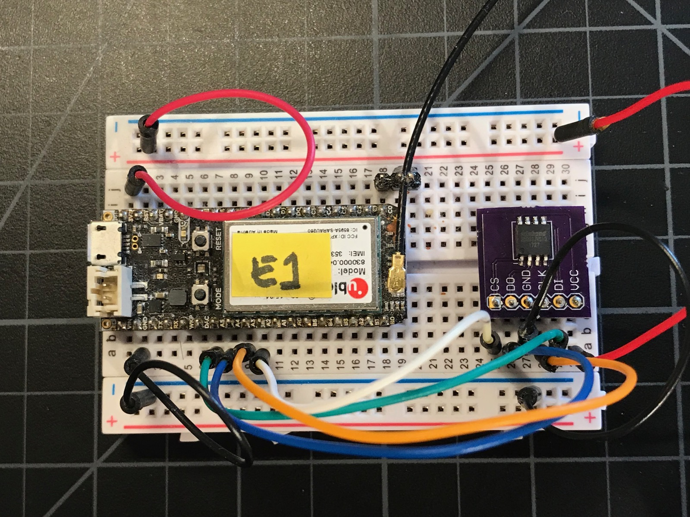
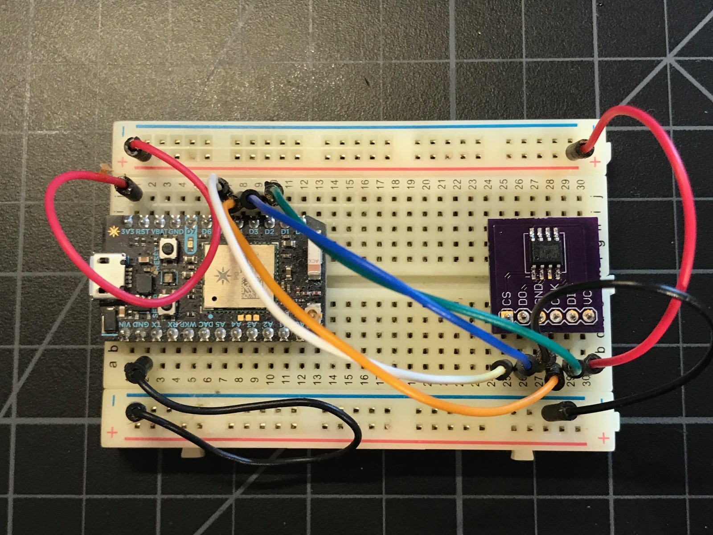

# SpiFlashRK

*Particle library for SPI NOR flash memory chips*

This library provides access to SPI NOR flash chips on the Particle platform. It's a low-level access that allows byte-level write-to-0 and sector-level erase-to-1.

You probably won't use this library directly; it's intended by be used as the hardware interface for a library that provides easier access, wear-leveling, flash translation, etc.. I recommend the SpiffsParticleRK library.

The full browsable API documentation can be found [here](http://rickkas7.github.io/SpiFlashRK/).

## Instantiating an object

You typically instantiate an object to interface to the flash chip as a global variable:

```
SpiFlashISSI spiFlash(SPI, A2);
```

Use an ISSI flash, such as a [IS25LQ080B](http://www.digikey.com/product-detail/en/issi-integrated-silicon-solution-inc/IS25LQ080B-JNLE/706-1331-ND/5189766). In this case, connected to the primary SPI with A2 as the CS (chip select or SS).

```
SpiFlashWinbond spiFlash(SPI, A2);
```

Use a Winbond flash, such as a [W25Q32](https://www.digikey.com/product-detail/en/winbond-electronics/W25Q32JVSSIQ/W25Q32JVSSIQ-ND/5803981). In this case, connected to the primary SPI with A2 as the CS (chip select or SS).

```
SpiFlashWinbond spiFlash(SPI1, D5);
```

Winbond flash, connected to the secondary SPI, SPI1, with D5 as the CS (chip select or SS).

```
SpiFlashMacronix spiFlash(SPI1, D5);
```

Macronix flash, such as the [MX25L8006EM1I-12G](https://www.digikey.com/product-detail/en/macronix/MX25L8006EM1I-12G/1092-1117-ND/2744800). In this case connected to the secondary SPI, SPI1, with D5 as the CS (chip select or SS). This is the recommended for use on the E-Series module. Note that this is the 0.154", 3.90mm width 8-SOIC package.


```
SpiFlashP1 spiFlash;
```

This is the external flash on the P1 module. This extra flash chip is entirely available for your user; it is not used by the system firmware. You can only use this on the P1; it relies on system functions that are not available on other devices.


## Connecting the hardware

For the primary SPI (SPI):

| Name | Flash Alt Name | Particle Pin | Example Color |
| ---- | -------------- | ------------ | ------------- |
| SS   | CS             | A2           | White         |
| SCK  | CLK            | A3           | Orange        |
| MISO | DO             | A4           | Blue          |
| MOSI | D1             | A5           | Green         |


For the secondary SPI (SPI1):

| Name | Flash Alt Name | Particle Pin | Example Color |
| ---- | -------------- | ------------ | ------------- |
| SS   | CS             | D5           | White         |
| SCK  | CLK            | D4           | Orange        |
| MISO | DO             | D3           | Blue          |
| MOSI | D1             | D2           | Green         |

Note that the SS/CS line can be any available GPIO pin, not just the one specified in the table above.

- Electron using Primary SPI



- Photon using Secondary SPI (SPI1)



- Photon using Primary SPI and a poorly hand-soldered 8-SOIC adapter


## The API

The API is described in the SpiFlashRK.h file. But you will rarely need to use the low-level API directly.
## Members


#### `public void `[`begin`](#class_spi_flash_base_1ac15f0d887b3f63e95c38fa07ad27b4ad)`()` 

Call begin, probably from setup(). The initializes the SPI object.

#### `public bool `[`isValid`](#class_spi_flash_base_1a1a556af53af5b4a535091ac48ccddf9d)`()` 

Returns true if there is a flash chip present and it appears to be the correct manufacturer code.

#### `public uint32_t `[`jedecIdRead`](#class_spi_flash_base_1aaafb065389237c90ed89ea61a1992743)`()` 

Gets the JEDEC ID for the flash device.

#### Returns
A 32-bit value containing the manufacturer ID and the two device IDs:

- byte[0] manufacturer ID mask 0x00ff0000 
- byte[1] device ID 1 mask 0x0000ff00 
- byte[2] device ID 2 mask 0x000000ff

#### `public void `[`readData`](#class_spi_flash_base_1a053c787ed441aee2830629cf077ed3b4)`(size_t addr,void * buf,size_t bufLen)` 

Reads data synchronously. Reads data correctly across page boundaries.

#### Parameters
* `addr` The address to read from 

* `buf` The buffer to store data in 

* `bufLen` The number of bytes to read

#### `public void `[`writeData`](#class_spi_flash_base_1ac47ed89cd11ad72a1e877c59cf3e2ab7)`(size_t addr,const void * buf,size_t bufLen)` 

Writes data synchronously. Can write data across page boundaries.

#### Parameters
* `addr` The address to read from 

* `buf` The buffer to store data in 

* `bufLen` The number of bytes to write

#### `public void `[`sectorErase`](#class_spi_flash_base_1abcab7312a96d40530981b06199b7dc9c)`(size_t addr)` 

Erases a sector. Sectors are sectorSize bytes and the smallest unit that can be erased.

This call blocks for the duration of the erase, which take take some time (up to 500 milliseconds).

#### Parameters
* `addr` Address of the beginning of the sector. Must be at the start of a sector boundary.

#### `public void `[`chipErase`](#class_spi_flash_base_1a22edd97067f1783351a4ee542c792007)`()` 

Erases the entire chip.

This call blocks for the duration of the erase, which take take some time (several secoonds). This function uses delay(1) so the cloud connection will be serviced in non-system-threaded mode.

#### `public inline size_t `[`getPageSize`](#class_spi_flash_base_1aebe4fbac5fbc17289682445968c4cd04)`() const` 

Gets the page size (default: 256)

#### `public inline `[`SpiFlashBase`](#class_spi_flash_base)` & `[`withPageSize`](#class_spi_flash_base_1a15345e20dd9986ef96b53e4cb86bf5b6)`(size_t value)` 

Sets the page size (default: 256)

#### `public inline size_t `[`getSectorSize`](#class_spi_flash_base_1a67d9998c73e8e4b8afe78b445516f745)`() const` 

Gets the sector size (default: 4096)

#### `public inline `[`SpiFlashBase`](#class_spi_flash_base)` & `[`withSectorSize`](#class_spi_flash_base_1a36a4e723f2acdd6fa4fb17b6d6e23d34)`(size_t value)` 

Sets the sector size (default: 4096)

## Version History

### 0.0.9 (2020-10-30)

- Increased Macronix chip erase timeout from 6000 to 240000 ms to deal with larger chips (like the MX25L25645G).
- Add support for 4-byte addressing mode for chips larger than 128 Mbit (16 Mbyte). See set4ByteAddressing().

### 0.0.7 (2020-10-29)

- SPI transaction implementation fixed to use actual beginTransaction()/endTransaction() for compatible with multiple SPI devices.

### 0.0.6 (2020-05-04)

- Fix compiler error for undefined conversion to SpiClass with 1.5.1-rc.1.
